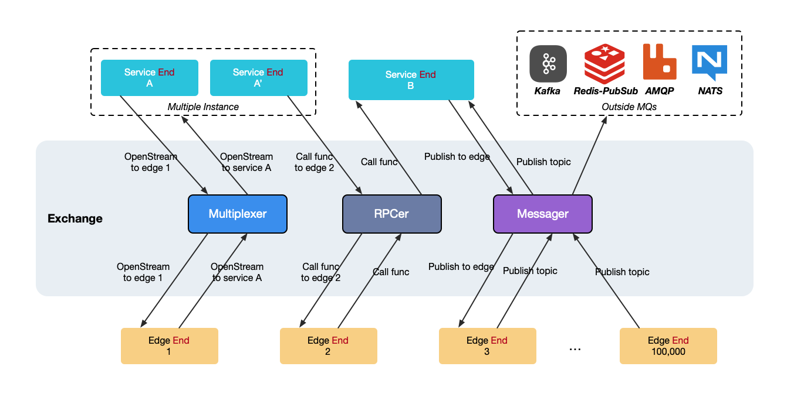
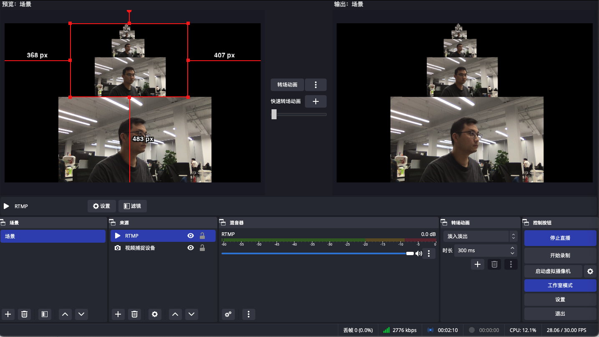
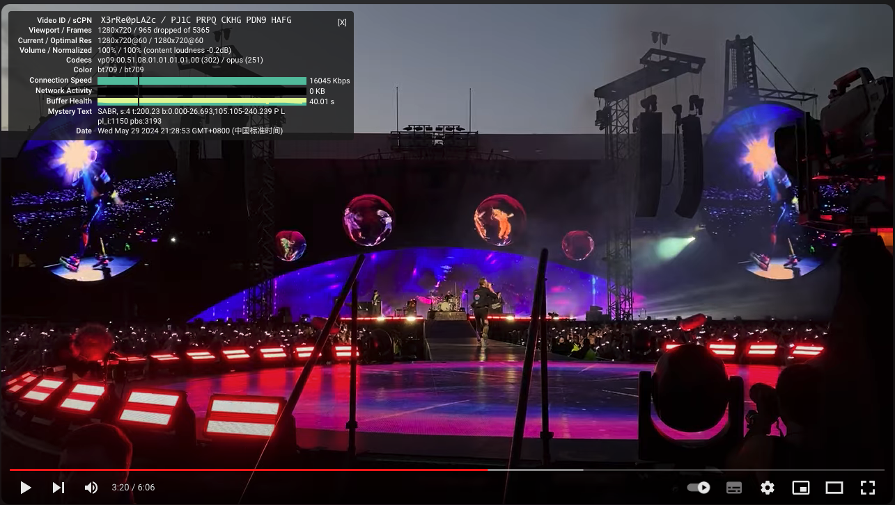
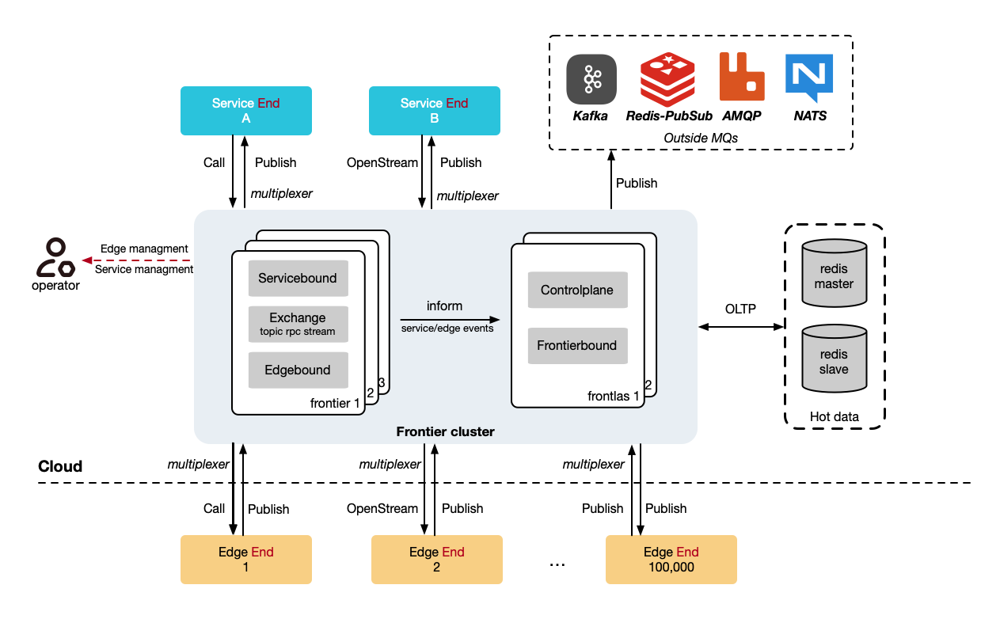

<p align=center>

</p>

<div align="center">

[](https://github.com/singchia/frontier/actions/workflows/go.yml)
[](https://goreportcard.com/report/github.com/singchia/frontier)
[](https://pkg.go.dev/github.com/singchia/frontier/api/dataplane/v1/service)
[](https://opensource.org/licenses/Apache-2.0)

English | [简体中文](./README_zh.md)

</div>

> Bidirectional service-to-edge gateway for long-lived connections

Frontier is an open-source gateway written in Go for **service <-> edge communication**. It lets backend services and edge nodes talk to each other over long-lived connections, with built-in **bidirectional RPC**, **messaging**, and **point-to-point streams**.

It is built for systems where both sides stay online and need to actively call, notify, or open streams to each other. Frontier is **not a reverse proxy** and **not just a message broker**. It is infrastructure for addressing and operating large fleets of connected edge nodes from backend services.

<p align="center">
  
</p>

## Why People Star Frontier

- **Different from API gateways**: Frontier is designed for backend-to-edge communication, not just north-south HTTP traffic.
- **Different from MQ**: It gives you bidirectional RPC, messaging, and streams in one connectivity model.
- **Different from tunnels**: Services can address a specific online edge node instead of only exposing a port.
- **Made for real fleets**: Works for devices, agents, clients, and remote connectors that stay online for a long time.

## What You Can Build

<table>
  <tr>
    <td width="50%">
      
      <p><strong>Traffic relay and media streaming</strong><br>Open point-to-point streams for RTMP relay, file transfer, proxy traffic, or other custom protocols.</p>
    </td>
    <td width="50%">
      
      <p><strong>Remote agents and device fleets</strong><br>Keep edge nodes online, route service calls to a specific edge, and let the edge call backend services back.</p>
    </td>
  </tr>
</table>

## At A Glance

| You need to... | Frontier gives you... |
| --- | --- |
| Call a specific online device or agent from your backend | Service -> Edge RPC and messaging over long-lived connections |
| Let edge nodes initiate calls without opening inbound ports | Edge -> Service RPC on the same connection model |
| Move bytes, not just request/response payloads | Point-to-point streams between service and edge |
| Run one control plane for a large connected fleet | Presence, lifecycle hooks, control APIs, clustering |

## Table of Contents

- [Why Frontier](#why-frontier)
- [Why People Star Frontier](#why-people-star-frontier)
- [What You Can Build](#what-you-can-build)
- [At A Glance](#at-a-glance)
- [When to Use Frontier](#when-to-use-frontier)
- [Real-World Use Cases](#real-world-use-cases)
- [Comparison](#comparison)
- [Quick Start](#quick-start)
- [Features](#features)
- [Architecture](#architecture)
- [Usage](#usage)
- [Configuration](#configuration)
- [Deployment](#deployment)
- [Cluster](#cluster)
- [Kubernetes](#kubernetes)
- [Development](#development)
- [Testing](#testing)
- [Community](#community)
- [License](#license)

## Why Frontier

Most infrastructure is optimized for one of these models:

- **service -> service** via HTTP or gRPC
- **client -> service** via API gateways and reverse proxies
- **event fan-out** via message brokers

Frontier is optimized for a different model:

- **service <-> edge** over long-lived, stateful connections
- backend services calling a specific online edge node
- edge nodes calling backend services without exposing inbound ports
- opening direct streams between services and edge nodes when RPC is not enough

<p align="center">
  
</p>

## When to Use Frontier

Use Frontier if you need:

- Backend services to call specific online devices, agents, clients, or connectors
- Edge nodes to call backend services over the same connectivity model
- Long-lived connections at large scale
- One data plane for RPC, messaging, and streams
- Cluster deployment and high availability for service-to-edge connectivity

Do not use Frontier if:

- You only need service-to-service RPC; gRPC is a simpler fit
- You only need HTTP ingress, routing, or proxying; use an API gateway or Envoy
- You only need pub/sub or event streaming; use NATS or Kafka
- You only need a generic tunnel; use frp or another tunneling tool

## Real-World Use Cases

- IoT and device fleets
- Remote agents and connectors
- IM and other real-time systems
- Game backends talking to online clients or edge nodes
- Zero-trust internal access based on connector-style agents
- File transfer, media relay, or traffic proxy over point-to-point streams

## Use Cases In One Screen

| Scenario | Why Frontier fits |
| --- | --- |
| Device control plane | Address a specific online edge node, push commands, receive state, and keep the link alive |
| Remote connector platform | Let connectors dial out, avoid inbound exposure, and keep service-side routing simple |
| Real-time apps | Maintain long-lived sessions and combine notifications, RPC, and streams in one path |
| Internal zero-trust access | Use agent-style edges as the last-mile bridge between backend systems and private resources |

## Comparison

| Capability | Frontier | gRPC | NATS | frp | Envoy |
| --- | --- | --- | --- | --- | --- |
| Built for service <-> edge communication | Yes | No | Partial | No | No |
| Backend can address a specific online edge node | Yes | No | Partial | Partial | No |
| Edge can call backend services | Yes | Partial | Yes | No | No |
| Point-to-point streams between service and edge | Yes | Partial | No | Tunnel only | No |
| Unified RPC + messaging + streams model | Yes | No | No | No | No |
| Long-lived connection fleet as a primary model | Yes | No | Partial | Partial | No |

`Partial` here means the capability can be assembled with extra patterns, but it is not the system's primary communication model.

## Quick Start

1. Start a single Frontier instance:

```bash
docker run -d --name frontier -p 30011:30011 -p 30012:30012 singchia/frontier:1.2.2
```

2. Build the examples:

```bash
make examples
```

3. Run the chatroom demo:

```bash
# Terminal 1
./bin/chatroom_service

# Terminal 2
./bin/chatroom_agent
```

The chatroom example shows the basic Frontier interaction model: long-lived connectivity, edge online/offline events, and service <-> edge messaging.

You can also run the RTMP example if you want to see Frontier's stream model used for traffic relay:

```bash
# Terminal 1
./bin/rtmp_service

# Terminal 2
./bin/rtmp_edge
```

Demo video:

https://github.com/singchia/frontier/assets/15531166/18b01d96-e30b-450f-9610-917d65259c30

## Features

- **Bidirectional RPC**: Services can call edges, and edges can call services.
- **Messaging**: Send messages between services and edges, and forward edge-published topics to external MQ.
- **Point-to-Point Streams**: Open direct streams for proxying, file transfer, media relay, and custom traffic.
- **Presence and Lifecycle Hooks**: Handle edge ID assignment plus online/offline notifications.
- **Control Plane APIs**: gRPC and REST APIs for querying and managing online nodes.
- **Cluster and HA**: Scale out with Frontlas, reconnect clients, and run highly available topologies.
- **Cloud-Native Deployment**: Run via Docker, Compose, Helm, or Operator.

## Architecture

Frontier sits between backend services and connected edge nodes. Both sides establish outbound long-lived connections to Frontier, then Frontier exposes a unified model for RPC, messaging, and streams.


- _Service End_: Entry point for backend services.
- _Edge End_: Entry point for edge nodes or clients.
- _Publish/Receive_: Message publishing and receiving.
- _Call/Register_: RPC calling and method registration.
- _OpenStream/AcceptStream_: Point-to-point stream establishment.
- _External MQ_: Optional forwarding of edge-published messages to external MQ topics.

The default ports are:

- `:30011` for backend services to connect and obtain Service.
- `:30012` for edge nodes to connect and obtain Edge.
- `:30010` for operators or programs using the control plane.


### Functionality

<table><thead>
  <tr>
    <th>Function</th>
    <th>Initiator</th>
    <th>Receiver</th>
    <th>Method</th>
    <th>Routing Method</th>
    <th>Description</th>
  </tr></thead>
<tbody>
  <tr>
    <td rowspan="2">Messager</td>
    <td>Service</td>
    <td>Edge</td>
    <td>Publish</td>
    <td>EdgeID+Topic</td>
    <td>Must publish to a specific EdgeID, the default topic is empty. The edge calls Receive to receive the message, and after processing, must call msg.Done() or msg.Error(err) to ensure message consistency.</td>
  </tr>
  <tr>
    <td>Edge</td>
    <td>Service or External MQ</td>
    <td>Publish</td>
    <td>Topic</td>
    <td>Must publish to a topic, and Frontier selects a specific Service or MQ based on the topic.</td>
  </tr>
  <tr>
    <td rowspan="2">RPCer</td>
    <td>Service</td>
    <td>Edge</td>
    <td>Call</td>
    <td>EdgeID+Method</td>
    <td>Must call a specific EdgeID, carrying the method name.</td>
  </tr>
  <tr>
    <td>Edge</td>
    <td>Service</td>
    <td>Call</td>
    <td>Method</td>
    <td>Must call a method, and Frontier selects a specific Service based on the method name.</td>
  </tr>
  <tr>
    <td rowspan="2">Multiplexer</td>
    <td>Service</td>
    <td>Edge</td>
    <td>OpenStream</td>
    <td>EdgeID</td>
    <td>Must open a stream to a specific EdgeID.</td>
  </tr>
  <tr>
    <td>Edge</td>
    <td>Service</td>
    <td>OpenStream</td>
    <td>ServiceName</td>
    <td>Must open a stream to a ServiceName, specified by service.OptionServiceName during Service initialization.</td>
  </tr>
</tbody></table>

**Key design principles include**:

1. All messages, RPCs, and streams are point-to-point.
   - From services to edges, the edge node ID must be specified.
   - From edges to services, Frontier routes by topic or method, then selects a service or external MQ through hashing. The default hash key is `edgeid`, but `random` and `srcip` are also available.
2. Messages require explicit completion by the receiver.
   - Call `msg.Done()` or `msg.Error(err)` to preserve delivery semantics.
3. Streams opened by the Multiplexer logically represent direct service-to-edge communication.
   - Once the other side accepts the stream, traffic on that stream bypasses Frontier's higher-level routing rules.

## Usage

Detailed usage guide: [docs/USAGE.md](./docs/USAGE.md)

## Configuration

Detailed configuration guide: [docs/CONFIGURATION.md](./docs/CONFIGURATION.md)

## Deployment

In a single Frontier instance, you can choose the following methods to deploy your Frontier instance based on your environment.

### Docker

```bash
docker run -d --name frontier -p 30011:30011 -p 30012:30012 singchia/frontier:1.2.2
```

### Docker-Compose

```bash
git clone https://github.com/singchia/frontier.git
cd dist/compose
docker-compose up -d frontier
```

### Helm

If you are in a Kubernetes environment, you can use Helm to quickly deploy an instance.

```bash
git clone https://github.com/singchia/frontier.git
cd dist/helm
helm install frontier ./ -f values.yaml
```

Your microservice should connect to ```service/frontier-servicebound-svc:30011```, and your edge node can connect to the NodePort where `:30012` is located.

### Systemd

Use the dedicated Systemd docs:

[dist/systemd/README.md](./dist/systemd/README.md)

### Operator

See the cluster deployment section below.

## Cluster

### Frontier + Frontlas Architecture


The additional Frontlas component is used to build the cluster. Frontlas is also a stateless component and does not store other information in memory, so it requires additional dependency on Redis. You need to provide a Redis connection information to Frontlas, supporting `redis`, `sentinel`, and `redis-cluster`.

- _Frontier_: Communication component between microservices and edge data planes.
- _Frontlas_: Named Frontier Atlas, a cluster management component that records metadata and active information of microservices and edges in Redis.

Frontier needs to proactively connect to Frontlas to report its own, microservice, and edge active and status. The default ports for Frontlas are:

- `:40011` for microservices connection, replacing the 30011 port in a single Frontier instance.
- `:40012` for Frontier connection to report status.

You can deploy any number of Frontier instances as needed, and for Frontlas, deploying two instances separately can ensure HA (High Availability) since it does not store state and has no consistency issues.

### Configuration

**Frontier**'s `frontier.yaml` needs to add the following configuration:

```yaml
frontlas:
  enable: true
  dial:
    network: tcp
    addr:
      - 127.0.0.1:40012
  metrics:
    enable: false
    interval: 0
daemon:
  # Unique ID within the Frontier cluster
  frontier_id: frontier01
```

Frontier needs to connect to Frontlas to report its own, microservice, and edge active and status.

**Frontlas**'s `frontlas.yaml` minimal configuration:

```yaml
control_plane:
  listen:
    # Microservices connect to this address to discover edges in the cluster
    network: tcp
    addr: 0.0.0.0:40011
frontier_plane:
  # Frontier connects to this address
  listen:
    network: tcp
    addr: 0.0.0.0:40012
  expiration:
    # Expiration time for microservice metadata in Redis
    service_meta: 30
    # Expiration time for edge metadata in Redis
    edge_meta: 30
redis:
  # Support for standalone, sentinel, and cluster connections
  mode: standalone
  standalone:
    network: tcp
    addr: redis:6379
    db: 0
```

### Usage

Since Frontlas is used to discover available Frontiers, microservices need to adjust as follows:

**Microservice Getting Service**

```golang
package main

import (
  "net"
  "github.com/singchia/frontier/api/dataplane/v1/service"
)

func main() {
  // Use NewClusterService to get Service
  svc, err := service.NewClusterService("127.0.0.1:40011")
  // Start using service, everything else remains unchanged
}
```

**Edge Node Getting Connection Address**

For edge nodes, they still connect to Frontier but can get available Frontier addresses from Frontlas. Frontlas provides an interface to list Frontier instances:

```bash
curl -X GET http://127.0.0.1:40011/cluster/v1/frontiers
```

You can wrap this interface to provide load balancing or high availability for edge nodes, or add mTLS to directly provide to edge nodes (not recommended).

Control Plane gRPC See [Protobuf Definition](./api/controlplane/frontlas/v1/cluster.proto).

The Frontlas control plane differs from Frontier as it is a cluster-oriented control plane, currently providing only read interfaces for the cluster.

```protobuf
service ClusterService {
    rpc GetFrontierByEdge(GetFrontierByEdgeIDRequest) returns (GetFrontierByEdgeIDResponse);
    rpc ListFrontiers(ListFrontiersRequest) returns (ListFrontiersResponse);

    rpc ListEdges(ListEdgesRequest) returns (ListEdgesResponse);
    rpc GetEdgeByID(GetEdgeByIDRequest) returns (GetEdgeByIDResponse);
    rpc GetEdgesCount(GetEdgesCountRequest) returns (GetEdgesCountResponse);

    rpc ListServices(ListServicesRequest) returns (ListServicesResponse);
    rpc GetServiceByID(GetServiceByIDRequest) returns (GetServiceByIDResponse);
    rpc GetServicesCount(GetServicesCountRequest) returns (GetServicesCountResponse);
}
```

## Kubernetes

### Operator

**Install CRD and Operator**

Follow these steps to install and deploy the Operator to your .kubeconfig environment:

```bash
git clone https://github.com/singchia/frontier.git
cd dist/crd
kubectl apply -f install.yaml
```

Check CRD:

```bash
kubectl get crd frontierclusters.frontier.singchia.io
```

Check Operator:

```bash
kubectl get all -n frontier-system
```

**FrontierCluster**

```yaml
apiVersion: frontier.singchia.io/v1alpha1
kind: FrontierCluster
metadata:
  labels:
    app.kubernetes.io/name: frontiercluster
    app.kubernetes.io/managed-by: kustomize
  name: frontiercluster
spec:
  frontier:
    # Single instance Frontier
    replicas: 2
    # Microservice side port
    servicebound:
      port: 30011
    # Edge node side port
    edgebound:
      port: 30012
  frontlas:
    # Single instance Frontlas
    replicas: 1
    # Control plane port
    controlplane:
      port: 40011
    redis:
      # Dependent Redis configuration
      addrs:
        - rfs-redisfailover:26379
      password: your-password
      masterName: mymaster
      redisType: sentinel
```

Save as`frontiercluster.yaml`，and

```
kubectl apply -f frontiercluster.yaml
```

In 1 minute, you will have a 2-instance Frontier + 1-instance Frontlas cluster.

Check resource deployment status with:

```bash
kubectl get all -l app=frontiercluster-frontier  
kubectl get all -l app=frontiercluster-frontlas
```

```
NAME                                           READY   STATUS    RESTARTS   AGE
pod/frontiercluster-frontier-57d565c89-dn6n8   1/1     Running   0          7m22s
pod/frontiercluster-frontier-57d565c89-nmwmt   1/1     Running   0          7m22s
NAME                                       TYPE        CLUSTER-IP      EXTERNAL-IP   PORT(S)          AGE
service/frontiercluster-edgebound-svc      NodePort    10.233.23.174   <none>        30012:30012/TCP  8m7s
service/frontiercluster-servicebound-svc   ClusterIP   10.233.29.156   <none>        30011/TCP        8m7s
NAME                                       READY   UP-TO-DATE   AVAILABLE   AGE
deployment.apps/frontiercluster-frontier   2/2     2            2           7m22s
NAME                                                 DESIRED   CURRENT   READY   AGE
replicaset.apps/frontiercluster-frontier-57d565c89   2         2         2       7m22s
```

```
NAME                                            READY   STATUS    RESTARTS   AGE
pod/frontiercluster-frontlas-85c4fb6d9b-5clkh   1/1     Running   0          8m11s
NAME                                   TYPE        CLUSTER-IP    EXTERNAL-IP   PORT(S)               AGE
service/frontiercluster-frontlas-svc   ClusterIP   10.233.0.23   <none>        40011/TCP,40012/TCP   8m11s
NAME                                       READY   UP-TO-DATE   AVAILABLE   AGE
deployment.apps/frontiercluster-frontlas   1/1     1            1           8m11s
NAME                                                  DESIRED   CURRENT   READY   AGE
replicaset.apps/frontiercluster-frontlas-85c4fb6d9b   1         1         1       8m11s
```

Your microservice should connect to `service/frontiercluster-frontlas-svc:40011`, and your edge node can connect to the NodePort where `:30012` is located.

## Development

### Roadmap

See [ROADMAP](./ROADMAP.md)

### Contributions

If you find any bugs, please open an issue, and project maintainers will respond promptly.

If you wish to submit features or more quickly address project issues, you are welcome to submit PRs under these simple conditions:

- Code style remains consistent
- Each submission includes one feature
- Submitted code includes unit tests

## Testing

### Stream Function


## Community

<p align=center>

</p>

Join our WeChat group for discussions and support.

## License

 Released under the [Apache License 2.0](https://github.com/singchia/geminio/blob/main/LICENSE)

---
A Star ⭐️ would be greatly appreciated ♥️
