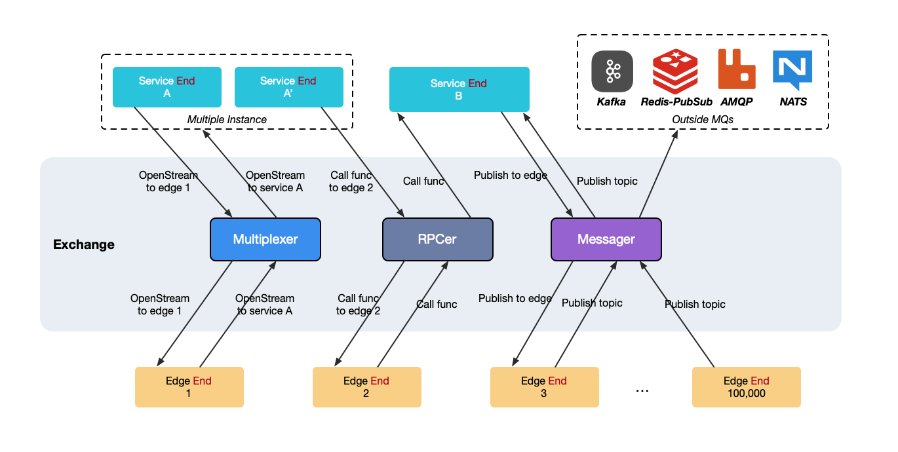

<p align=center>

</p>

<div align="center">

[](https://github.com/singchia/frontier/actions/workflows/go.yml)
[](https://goreportcard.com/report/github.com/singchia/frontier)
[](https://pkg.go.dev/github.com/singchia/frontier/api/dataplane/v1/service)
[](https://opensource.org/licenses/Apache-2.0)

[简体中文](./README.md) | English

</div>


Frontier is a full-duplex, open-source long-connection gateway developed in Go. It aims to allow microservices to directly reach edge nodes or clients, and vice versa. It provides full-duplex bidirectional RPC calls, message publishing and receiving, and point-to-point stream functionality for both. Frontier complies with cloud-native architecture, enabling quick deployment of a cluster using Operator, ensuring high availability and elasticity, and easily supporting the requirement of millions of online edge nodes or clients.

## Features

- **RPC**: Microservices and edges can call each other's functions (pre-registered), with load balancing supported on the microservice side.
- **Messaging**: Microservices and edges can publish to each other's topics, and edges can publish to external MQ topics, with load balancing supported on the microservice side.
- **Multiplexing/Streams**: Microservices can directly open a stream (connection) on edge nodes, enabling functions like file upload and proxy, turning obstacles into pathways.
- **Online/Offline Control**: Microservices can register to get edge node IDs, and callbacks for online/offline events. When these events occur, Frontier will invoke these functions.
- **Simple API**: The project provides well-packaged SDKs in the api directory for both edges and microservices, making development based on this SDK very simple.
- **Easy Deployment**: Supports various deployment methods (docker, docker-compose, helm, and operator) to deploy Frontier instances or clusters.
- **Horizontal Scaling**: Provides Frontier and Frontlas clusters. When single instance performance reaches a bottleneck, you can horizontally scale Frontier instances or clusters.
- **High Availability**: Supports cluster deployment and allows microservices and edge nodes to permanently reconnect using the SDK. In case of current instance failure, it switches to a new available instance to continue services.
- **Control Plane Support**: Provides gRPC and REST interfaces, allowing operation personnel to query or delete microservices and edge nodes. Deletion will force the target offline.


## Architecture

**Frontier Component**



- _Service End_: The entry point for microservice functions, connecting by default.
- _Edge End_: The entry point for edge node or client functions.
- _Publish/Receive_: Publishing and receiving messages.
- _Call/Register_: Calling and registering functions.
- _OpenStream/AcceptStream_: Opening and accepting point-to-point streams (connections).
- _External MQ_: Frontier supports forwarding messages published from edge nodes to external MQ topics based on configuration.


Frontier requires both microservices and edge nodes to actively connect to Frontier. The metadata of Service and Edge (receiving topics, RPC, service names, etc.) can be carried during the connection. The default connection ports are:

- :30011: For microservices to connect and obtain Service.
- :30012: For edge nodes to connect and obtain Edge.
- :30010: For operations personnel or programs to use the control plane.


### Functionality

<table><thead>
  <tr>
    <th>Function</th>
    <th>Initiator</th>
    <th>Receiver</th>
    <th>Method</th>
    <th>Routing Method</th>
    <th>Description</th>
  </tr></thead>
<tbody>
  <tr>
    <td rowspan="2">Messager</td>
    <td>Service</td>
    <td>Edge</td>
    <td>Publish</td>
    <td>EdgeID+Topic</td>
    <td>Must publish to a specific EdgeID, the default topic is empty. The edge calls Receive to receive the message, and after processing, must call msg.Done() or msg.Error(err) to ensure message consistency.</td>
  </tr>
  <tr>
    <td>Edge</td>
    <td>Service or External MQ</td>
    <td>Publish</td>
    <td>Topic</td>
    <td>Must publish to a topic, and Frontier selects a specific Service or MQ based on the topic.</td>
  </tr>
  <tr>
    <td rowspan="2">RPCer</td>
    <td>Service</td>
    <td>Edge</td>
    <td>Call</td>
    <td>EdgeID+Method</td>
    <td>Must call a specific EdgeID, carrying the method name.</td>
  </tr>
  <tr>
    <td>Edge</td>
    <td>Service</td>
    <td>Call</td>
    <td>Method</td>
    <td>Must call a method, and Frontier selects a specific Service based on the method name.</td>
  </tr>
  <tr>
    <td rowspan="2">Multiplexer</td>
    <td>Service</td>
    <td>Edge</td>
    <td>OpenStream</td>
    <td>EdgeID</td>
    <td>Must open a stream to a specific EdgeID.</td>
  </tr>
  <tr>
    <td>Edge</td>
    <td>Service</td>
    <td>OpenStream</td>
    <td>ServiceName</td>
    <td>Must open a stream to a ServiceName, specified by service.OptionServiceName during Service initialization.</td>
  </tr>
</tbody></table>

**Key design principles include**:

1. All messages, RPCs, and Streams are point-to-point transmissions.
	- From microservices to edges, the edge node ID must be specified.
	- From edges to microservices, Frontier routes based on Topic and Method, and finally selects a microservice or external MQ through hashing. The default is hashing based on edgeid, but you can choose random or srcip.
2. Messages require explicit acknowledgment by the receiver.
	- To ensure message delivery semantics, the receiver must call msg.Done() or msg.Error(err) to ensure delivery consistency.
3. Streams opened by the Multiplexer logically represent direct communication between microservices and edge nodes.
	- Once the other side receives the stream, all functionalities on this stream will directly reach the other side, bypassing Frontier's routing policies.

## Usage

### Example

In the [examples/chatroom](./examples/chatroom) directory, there is a simple chatroom example implemented in just 100 lines of code. You can get the executable programs chatroom\_service and chatroom\_agent by running:

```
make examples
```

Run the example:

https://github.com/singchia/frontier/assets/15531166/18b01d96-e30b-450f-9610-917d65259c30

In this example, you can see features like online/offline notifications and message publishing.

### How microservice use

**Getting Service on the Microservice Side**:

```golang
package main

import (
	"net"
	"github.com/singchia/frontier/api/dataplane/v1/service"
)

func main() {
	dialer := func() (net.Conn, error) {
		return net.Dial("tcp", "127.0.0.1:30011")
	}
	svc, err := service.NewService(dialer)
	// Start using the service
}
```

**Receiving ID, Online/Offline Notifications on Microservice Side**:

```golang
package main

import (
	"context"
	"net"
	"github.com/singchia/frontier/api/dataplane/v1/service"
)

func main() {
	dialer := func() (net.Conn, error) {
		return net.Dial("tcp", "127.0.0.1:30011")
	}
	svc, _ := service.NewService(dialer)
	svc.RegisterGetEdgeID(context.TODO(), getID)
	svc.RegisterEdgeOnline(context.TODO(), online)
	svc.RegisterEdgeOffline(context.TODO(), offline)
}

// The service can assign IDs to edges based on metadata
func getID(meta []byte) (uint64, error) {
	return 0, nil
}

// Edge goes online
func online(edgeID uint64, meta []byte, addr net.Addr) error {
	return nil
}

// Edge goes offline
func offline(edgeID uint64, meta []byte, addr net.Addr) error {
	return nil
}
```

**Microservice Publishing Messages to Edge Nodes**:

The edge must be online beforehand, otherwise the edge cannot be found.
```golang
package main

import (
	"context"
	"net"
	"github.com/singchia/frontier/api/dataplane/v1/service"
)

func main() {
	dialer := func() (net.Conn, error) {
		return net.Dial("tcp", "127.0.0.1:30011")
	}
	svc, _ := service.NewService(dialer)
	msg := svc.NewMessage([]byte("test"))
	// Publish a message to the edge node with ID 1001
	err := svc.Publish(context.TODO(), 1001, msg)
	// ...
}
```

**Microservice Declaring Topic to Receive**:

```golang
package main

import (
	"context"
	"fmt"
	"io"
	"net"
	"github.com/singchia/frontier/api/dataplane/v1/service"
)

func main() {
	dialer := func() (net.Conn, error) {
		return net.Dial("tcp", "127.0.0.1:30011")
	}
	// Declare the topic to receive when getting the service
	svc, _ := service.NewService(dialer, service.OptionServiceReceiveTopics([]string{"foo"}))
	for {
		// Receive messages
		msg, err := svc.Receive(context.TODO())
		if err == io.EOF {
			// Receiving EOF indicates the lifecycle of the service has ended and it can no longer be used
			return
		}
		if err != nil {
			fmt.Println("receive err:", err)
			continue
		}
		// After processing the message, notify the caller it is done
		msg.Done()
	}
}
```

**Microservice Calling Edge Node RPC**:

```golang
package main

import (
	"context"
	"net"
	"github.com/singchia/frontier/api/dataplane/v1/service"
)

func main() {
	dialer := func() (net.Conn, error) {
		return net.Dial("tcp", "127.0.0.1:30011")
	}
	svc, _ := service.NewService(dialer)
	req := svc.NewRequest([]byte("test"))
	// Call the "foo" method on the edge node with ID 1001. The edge node must have pre-registered this method.
	rsp, err := svc.Call(context.TODO(), 1001, "foo", req)
	// ...
}
```

**Microservice Registering Methods for Edge Nodes to Call**:

```golang
package main

import (
	"context"
	"net"
	"github.com/singchia/frontier/api/dataplane/v1/service"
	"github.com/singchia/geminio"
)

func main() {
	dialer := func() (net.Conn, error) {
		return net.Dial("tcp", "127.0.0.1:30011")
	}
	svc, _ := service.NewService(dialer)
	// Register an "echo" method
	svc.Register(context.TODO(), "echo", echo)
	// ...
}

func echo(ctx context.Context, req geminio.Request, rsp geminio.Response) {
	value := req.Data()
	rsp.SetData(value)
}
```

**Microservice Opening Point-to-Point Stream on Edge Node**:

```golang
package main

import (
	"context"
	"net"
	"github.com/singchia/frontier/api/dataplane/v1/service"
)

func main() {
	dialer := func() (net.Conn, error) {
		return net.Dial("tcp", "127.0.0.1:30011")
	}
	svc, _ := service.NewService(dialer)
	// Open a new stream to the edge node with ID 1001 (st is also a net.Conn). The edge must accept the stream with AcceptStream.
	st, err := svc.OpenStream(context.TODO(), 1001)
}
```
Based on this newly opened stream, you can transfer files, proxy traffic, etc.

**Microservice Receives Stream**:

```golang
package main

import (
	"fmt"
	"io"
	"net"
	"github.com/singchia/frontier/api/dataplane/v1/service"
)

func main() {
	dialer := func() (net.Conn, error) {
		return net.Dial("tcp", "127.0.0.1:30011")
	}
	// Declare the service name when getting the service, required when the edge opens a stream to specify the service name.
	svc, _ := service.NewService(dialer, service.OptionServiceName("service-name"))
	for {
		st, err := svc.AcceptStream()
		if err == io.EOF {
			// Receiving EOF indicates the lifecycle of the service has ended and it can no longer be used
			return
		} else if err != nil {
			fmt.Println("accept stream err:", err)
			continue
		}
		// Use the stream. This stream is also a net.Conn. You can Read/Write/Close, and also use RPC and messaging.
	}
}
```
Based on this newly opened stream, you can transfer files, proxy traffic, etc.

**Messages, RPC, and Streams Together!**:

```golang
package main

import (
	"context"
	"fmt"
	"io"
	"net"
	"github.com/singchia/frontier/api/dataplane/v1/service"
	"github.com/singchia/geminio"
)

func main() {
	dialer := func() (net.Conn, error) {
		return net.Dial("tcp", "127.0.0.1:30011")
	}
	// Declare the service name when getting the service, required when the edge opens a stream to specify the service name.
	svc, _ := service.NewService(dialer, service.OptionServiceName("service-name"))

	// Receive streams
	go func() {
		for {
			st, err := svc.AcceptStream()
			if err == io.EOF {
				// Receiving EOF indicates the lifecycle of the service has ended and it can no longer be used
				return
			} else if err != nil {
				fmt.Println("accept stream err:", err)
				continue
			}
			// Use the stream. This stream is also a net.Conn. You can Read/Write/Close, and also use RPC and messaging.
		}
	}()

	// Register an "echo" method
	svc.Register(context.TODO(), "echo", echo)

	// Receive messages
	for {
		msg, err := svc.Receive(context.TODO())
		if err == io.EOF {
			// Receiving EOF indicates the lifecycle of the service has ended and it can no longer be used
			return
		}
		if err != nil {
			fmt.Println("receive err:", err)
			continue
		}
		// After processing the message, notify the caller it is done
		msg.Done()
	}
}

func echo(ctx context.Context, req geminio.Request, rsp geminio.Response) {
	value := req.Data()
	rsp.SetData(value)
}
```

### How edge use

**Getting Edge on the Edge Node Side**:

```golang
package main

import (
	"net"
	"github.com/singchia/frontier/api/dataplane/v1/edge"
)

func main() {
	dialer := func() (net.Conn, error) {
		return net.Dial("tcp", "127.0.0.1:30012")
	}
	eg, _ := edge.NewEdge(dialer)
	// Start using eg ...
}
```

**Edge Node Publishes Message to Topic**:

The service needs to declare receiving the topic in advance, or configure an external MQ in the configuration file.

```golang
package main

import (
	"context"
	"net"
	"github.com/singchia/frontier/api/dataplane/v1/edge"
)

func main() {
	dialer := func() (net.Conn, error) {
		return net.Dial("tcp", "127.0.0.1:30012")
	}
	eg, _ := edge.NewEdge(dialer)
	// Start using eg
	msg := eg.NewMessage([]byte("test"))
	err := eg.Publish(context.TODO(), "foo", msg)
	// ...
}
```

**Edge Node Receives Messages**:

```golang
package main

import (
	"context"
	"fmt"
	"io"
	"net"
	"github.com/singchia/frontier/api/dataplane/v1/edge"
)

func main() {
	dialer := func() (net.Conn, error) {
		return net.Dial("tcp", "127.0.0.1:30012")
	}
	eg, _ := edge.NewEdge(dialer)
	for {
		// Receive messages
		msg, err := eg.Receive(context.TODO())
		if err == io.EOF {
			// Receiving EOF indicates the lifecycle of eg has ended and it can no longer be used
			return
		}
		if err != nil {
			fmt.Println("receive err:", err)
			continue
		}
		// After processing the message, notify the caller it is done
		msg.Done()
	}
	// ...
}
```

**Edge Node Calls RPC on Microservice**:

```golang
package main

import (
	"context"
	"net"
	"github.com/singchia/frontier/api/dataplane/v1/edge"
)

func main() {
	dialer := func() (net.Conn, error) {
		return net.Dial("tcp", "127.0.0.1:30012")
	}
	eg, _ := edge.NewEdge(dialer)
	// Start using eg
	req := eg.NewRequest([]byte("test"))
	// Call the "echo" method. Frontier will look up and forward the request to the corresponding microservice.
	rsp, err := eg.Call(context.TODO(), "echo", req)
}
```

**Edge Node Registers RPC**:

```golang
package main

import (
	"context"
	"net"
	"github.com/singchia/frontier/api/dataplane/v1/edge"
	"github.com/singchia/geminio"
)

func main() {
	dialer := func() (net.Conn, error) {
		return net.Dial("tcp", "127.0.0.1:30012")
	}
	eg, _ := edge.NewEdge(dialer)
	// Register an "echo" method
	eg.Register(context.TODO(), "echo", echo)
	// ...
}

func echo(ctx context.Context, req geminio.Request, rsp geminio.Response) {
	value := req.Data()
	rsp.SetData(value)
}
```

**Edge Node Opens Point-to-Point Stream to Microservice**:

```golang
package main

import (
	"net"
	"github.com/singchia/frontier/api/dataplane/v1/edge"
)

func main() {
	dialer := func() (net.Conn, error) {
		return net.Dial("tcp", "127.0.0.1:30012")
	}
	eg, _ := edge.NewEdge(dialer)
	st, err := eg.OpenStream("service-name")
	// ...
}
```

Based on this newly opened stream, you can transfer files, proxy traffic, etc.

**Edge Node Receives Stream**:

```golang
package main

import (
	"net"
	"fmt"
	"io"
	"github.com/singchia/frontier/api/dataplane/v1/edge"
)

func main() {
	dialer := func() (net.Conn, error) {
		return net.Dial("tcp", "127.0.0.1:30012")
	}
	eg, _ := edge.NewEdge(dialer)
	for {
		stream, err := eg.AcceptStream()
		if err == io.EOF {
			// Receiving EOF indicates the lifecycle of eg has ended and it can no longer be used
			return
		} else if err != nil {
			fmt.Println("accept stream err:", err)
			continue
		}
		// Use the stream. This stream is also a net.Conn. You can Read/Write/Close, and also use RPC and messaging.
	}
}
```

### Error Handling

<table><thead>
  <tr>
    <th>Error</th>
    <th>Description and Handling</th>
  </tr></thead>
<tbody>
  <tr>
    <td>io.EOF</td>
    <td>Receiving EOF indicates that the stream or connection has been closed, and you need to exit operations such as Receive and AcceptStream.</td>
  </tr>
  <tr>
    <td>io.ErrShortBuffer</td>
    <td>The buffer on the sender or receiver is full. You can adjust the buffer size by setting OptionServiceBufferSize or OptionEdgeBufferSize.</td>
  </tr>
  <tr>
    <td>apis.ErrEdgeNotOnline</td>
    <td>This indicates that the edge node is not online, and you need to check the edge connection.</td>
  </tr>
  <tr>
    <td>apis.ServiceNotOnline</td>
    <td>This indicates that the microservice is not online, and you need to check the microservice connection information or connection.</td>
  </tr>
  <tr>
    <td>apis.RPCNotOnline</td>
    <td>This indicates that the RPC called is not online.</td>
  </tr>
  <tr>
    <td>apis.TopicNotOnline</td>
    <td>This indicates that the topic to be published is not online.</td>
  </tr>
  <tr>
    <td>Other Errors</td>
    <td>There are also errors like Timeout, BufferFull, etc.</td>
  </tr>
</tbody>
</table>
It should be noted that if the stream is closed, any blocking methods on the stream will immediately receive io.EOF. If the entry point (Service and Edge) is closed, all streams on it will immediately receive io.EOF for blocking methods.

### Controlplane

The Frontier control plane provides gRPC and REST interfaces. Operators can use these APIs to determine the connection status of the current instance. Both gRPC and REST are served on the default port :`30010`.

**GRPC**  See[Protobuf Definition](./api/controlplane/frontier/v1/controlplane.proto) 

```protobuf
service ControlPlane {
    rpc ListEdges(ListEdgesRequest) returns (ListEdgesResponse);
    rpc GetEdge(GetEdgeRequest) returns (Edge);
    rpc KickEdge(KickEdgeRequest) returns (KickEdgeResponse);
    rpc ListEdgeRPCs(ListEdgeRPCsRequest) returns (ListEdgeRPCsResponse);
    rpc ListServices(ListServicesRequest) returns (ListServicesResponse);
    rpc GetService(GetServiceRequest) returns (Service);
    rpc KickService(KickServiceRequest) returns (KickServiceResponse);
    rpc ListServiceRPCs(ListServiceRPCsRequest) returns (ListServiceRPCsResponse);
    rpc ListServiceTopics(ListServiceTopicsRequest) returns (ListServiceTopicsResponse);
}
```

REST Swagger definition can be found at [Swagger Definition](./docs/swagger/swagger.yaml)

For example, you can use the following request to kick an edge node offline:

```
curl -X DELETE http://127.0.0.1:30010/v1/edges/{edge_id} 
```

Or check which RPCs a microservice has registered:


```
curl -X GET http://127.0.0.1:30010/v1/services/rpcs?service_id={service_id}
```

Note: gRPC/REST depends on the DAO backend, with two options: ```buntdb``` and ```sqlite3```. Both use in-memory mode. For performance considerations, the default backend uses buntdb, and the count field in the list interface always returns -1. When you configure the backend to ```sqlite3```, it means you have a strong OLTP requirement for connected microservices and edge nodes on Frontier, such as encapsulating the web on Frontier. In this case, the count will return the total number.

## Frontier Configuration

If you need to further customize your Frontier instance, you can learn how various configurations work in this section. Customize your configuration, save it as ```frontier.yaml```, and mount it to the container at ```/usr/conf/frontier.yaml``` to take effect.

### Minimal Configuration

To get started, you can simply configure the service listening addresses for microservices and edge nodes:

```yaml
# Microservice configuration
servicebound:
  # Listening network
  listen:
    network: tcp
    # Listening address
    addr: 0.0.0.0:30011
# Edge node configuration
edgebound:
  # Listening network
  listen:
    network: tcp
    # Listening address
    addr: 0.0.0.0:30012
  # Whether to allow Frontier to allocate edgeID if no ID service is registered
  edgeid_alloc_when_no_idservice_on: true
```

### TLS

TLS configuration is supported for microservices, edge nodes, and control planes. mTLS is also supported, where Frontier verifies the client certificate.

```yaml
servicebound:
  listen:
    addr: 0.0.0.0:30011
    network: tcp
    tls:
      # Whether to enable TLS, default is disabled
      enable: false
      # Certificates and private keys, multiple pairs of certificates are allowed for client negotiation
      certs:
      - cert: servicebound.cert
        key: servicebound.key
      # Whether to enable mTLS, client certificates will be verified by the following CA
      mtls: false
      # CA certificates for verifying client certificates
      ca_certs:
      - ca1.cert
edgebound:
  listen:
    addr: 0.0.0.0:30012
    network: tcp
    tls:
      # Whether to enable TLS, default is disabled
      enable: false
      # Certificates and private keys, multiple pairs of certificates are allowed for client negotiation
      certs:
      - cert: edgebound.cert
        key: edgebound.key
      insecure_skip_verify: false
      # Whether to enable mTLS, client certificates will be verified by the following CA
      mtls: false
      # CA certificates for verifying client certificates
      ca_certs:
      - ca1.cert
```

### External MQ

If you need to configure an external MQ, Frontier supports publishing the corresponding topic to these MQs.

**AMQP**

```yaml
mqm:
  amqp:
    # Whether to allow
    enable: false
    # AMQP addresses
    addrs: null
    # Producer
    producer:
       # Exchange name
      exchange: ""
      # Equivalent to Frontier's internal topic concept, array values
      routing_keys: null
```

For AMQP, the above is the minimal configuration. If the topic of the message published by the edge node is in `routing_keys`, Frontier will publish to the `exchange.` If there are also microservices or other external MQs that declare the topic, Frontier will still choose one to publish based on hashby.

**Kafka**

```yaml
mqm:
  kafka:
    # Whether to allow
    enable: false
    # Kafka addresses
    addrs: null
    # Producer
       # Array values
      topics: null
```

For Kafka, the above is the minimal configuration. If the topic of the message published by the edge node is in the above array, Frontier will publish it. If there are also microservices or other external MQs that declare the topic, Frontier will still choose one to publish based on hashby.

**NATS**

```yaml
mqm:
  nats:
    # Whether to allow
    enable: false
    # NATS addresses
    addrs: null
    producer:
      # Equivalent to Frontier's internal topic concept, array values
      subjects: null
    # If Jetstream is allowed, it will be prioritized for publishing
    jetstream:
      enable: false
      # Jetstream name
      name: ""
      producer:
        # Equivalent to Frontier's internal topic concept, array values
        subjects: null
```

In NATS configuration, if Jetstream is allowed, it will be prioritized for publishing. If there are also microservices or other external MQs that declare the topic, Frontier will still choose one to publish based on hashby.

**NSQ**

```yaml
mqm:
  nsq:
    # Whether to allow
    enable: false
    # NSQ addresses
    addrs: null
    producer:
      # Array values
      topics: null
```
In NSQ's topics, if there are also microservices or other external MQs that declare the topic, Frontier will still choose one to publish based on hashby.

**Redis**

```yaml
mqm:
  redis:
    # Whether to allow
    enable: false
    # Redis addresses
    addrs: null
    # Redis DB
    db: 0
    # Password
    password: ""
    producer:
      # Equivalent to Frontier's internal topic concept, array values
      channels: null
```

If there are also microservices or other external MQs that declare the topic, Frontier will still choose one to publish based on hashby.

**Other Configurations**

```yaml
daemon:
  # Whether to enable PProf
  pprof:
    addr: 0.0.0.0:6060
    cpu_profile_rate: 0
    enable: true
  # Resource limits
  rlimit:
    enable: true
    nofile: 102400
  # Control plane enable
controlplane:
  enable: false
  listen:
    network: tcp
    addr: 0.0.0.0:30010
dao:
  # Supports buntdb and sqlite3, both use in-memory mode to remain stateless
  backend: buntdb
  # SQLite debug enable
  debug: false
exchange:
  # Frontier forwards edge node messages, RPCs, and open streams to microservices based on hash strategy: edgeid, srcip, or random, default is edgeid.
  # That is, the same edge node will always request the same microservice.
  hashby: edgeid
```

For more detailed configurations, see [frontier_all.yaml](./etc/frontier_all.yaml).

## Frontier Deployment

In a single Frontier instance, you can choose the following methods to deploy your Frontier instance based on your environment.

### Docker

```bash
docker run -d --name frontier -p 30011:30011 -p 30012:30012 singchia/frontier:1.1.0
```

### Docker-Compose

```bash
git clone https://github.com/singchia/frontier.git
cd dist/compose
docker-compose up -d frontier
```

### Helm

If you are in a Kubernetes environment, you can use Helm to quickly deploy an instance.

```bash
git clone https://github.com/singchia/frontier.git
cd dist/helm
helm install frontier ./ -f values.yaml
```

Your microservice should connect to ```service/frontier-servicebound-svc:30011```, and your edge node can connect to the NodePort where `:30012` is located.

### Operator

See the cluster deployment section below.

## Cluster

### Frontier + Frontlas 


The additional Frontlas component is used to build the cluster. Frontlas is also a stateless component and does not store other information in memory, so it requires additional dependency on Redis. You need to provide a Redis connection information to Frontlas, supporting `redis`, `sentinel`, and `redis-cluster`.

- _Frontier_: Communication component between microservices and edge data planes.
- _Frontlas_: Named Frontier Atlas, a cluster management component that records metadata and active information of microservices and edges in Redis.

Frontier needs to proactively connect to Frontlas to report its own, microservice, and edge active and status. The default ports for Frontlas are:

- `:40011` for microservices connection, replacing the 30011 port in a single Frontier instance.
- `:40012` for Frontier connection to report status.

You can deploy any number of Frontier instances as needed, and for Frontlas, deploying two instances separately can ensure HA (High Availability) since it does not store state and has no consistency issues.

### Configuration

**Frontier**'s `frontier.yaml` needs to add the following configuration:

```yaml
frontlas:
  enable: true
  dial:
    network: tcp
    addr:
      - 127.0.0.1:40012
  metrics:
    enable: false
    interval: 0
daemon:
  # Unique ID within the Frontier cluster
  frontier_id: frontier01
```

Frontier needs to connect to Frontlas to report its own, microservice, and edge active and status.

**Frontlas**'s `frontlas.yaml` minimal configuration:

```yaml
control_plane:
  listen:
    # Microservices connect to this address to discover edges in the cluster
    network: tcp
    addr: 0.0.0.0:40011
frontier_plane:
  # Frontier connects to this address
  listen:
    network: tcp
    addr: 0.0.0.0:40012
  expiration:
    # Expiration time for microservice metadata in Redis
    service_meta: 30
    # Expiration time for edge metadata in Redis
    edge_meta: 30
redis:
  # Support for standalone, sentinel, and cluster connections
  mode: standalone
  standalone:
    network: tcp
    addr: redis:6379
    db: 0
```

### Usage

Since Frontlas is used to discover available Frontiers, microservices need to adjust as follows:

**Microservice Getting Service**

```golang
package main

import (
  "net"
  "github.com/singchia/frontier/api/dataplane/v1/service"
)

func main() {
  // Use NewClusterService to get Service
  svc, err := service.NewClusterService("127.0.0.1:40011")
  // Start using service, everything else remains unchanged
}
```

**Edge Node Getting Connection Address**

For edge nodes, they still connect to Frontier but can get available Frontier addresses from Frontlas. Frontlas provides an interface to list Frontier instances:

```bash
curl -X GET http://127.0.0.1:40011/cluster/v1/frontiers
```

You can wrap this interface to provide load balancing or high availability for edge nodes, or add mTLS to directly provide to edge nodes (not recommended).

Control Plane gRPC See [Protobuf Definition](./api/controlplane/frontlas/v1/cluster.proto).

The Frontlas control plane differs from Frontier as it is a cluster-oriented control plane, currently providing only read interfaces for the cluster.

```protobuf
service ClusterService {
    rpc GetFrontierByEdge(GetFrontierByEdgeIDRequest) returns (GetFrontierByEdgeIDResponse);
    rpc ListFrontiers(ListFrontiersRequest) returns (ListFrontiersResponse);

    rpc ListEdges(ListEdgesRequest) returns (ListEdgesResponse);
    rpc GetEdgeByID(GetEdgeByIDRequest) returns (GetEdgeByIDResponse);
    rpc GetEdgesCount(GetEdgesCountRequest) returns (GetEdgesCountResponse);

    rpc ListServices(ListServicesRequest) returns (ListServicesResponse);
    rpc GetServiceByID(GetServiceByIDRequest) returns (GetServiceByIDResponse);
    rpc GetServicesCount(GetServicesCountRequest) returns (GetServicesCountResponse);
}
```

## Kubernetes

### Operator

**Install CRD and Operator**

Follow these steps to install and deploy the Operator to your .kubeconfig environment:

```bash
git clone https://github.com/singchia/frontier.git
cd dist/crd
kubectl apply -f install.yaml
```

Check CRD:

```bash
kubectl get crd frontierclusters.frontier.singchia.io
```

Check Operator:

```bash
kubectl get all -n frontier-system
```

**FrontierCluster**

```yaml
apiVersion: frontier.singchia.io/v1alpha1
kind: FrontierCluster
metadata:
  labels:
    app.kubernetes.io/name: frontiercluster
    app.kubernetes.io/managed-by: kustomize
  name: frontiercluster
spec:
  frontier:
    # Single instance Frontier
    replicas: 2
    # Microservice side port
    servicebound:
      port: 30011
    # Edge node side port
    edgebound:
      port: 30012
  frontlas:
    # Single instance Frontlas
    replicas: 1
    # Control plane port
    controlplane:
      port: 40011
    redis:
      # Dependent Redis configuration
      addrs:
        - rfs-redisfailover:26379
      password: your-password
      masterName: mymaster
      redisType: sentinel
```

Save as`frontiercluster.yaml`，and

```
kubectl apply -f frontiercluster.yaml
```

In 1 minute, you will have a 2-instance Frontier + 1-instance Frontlas cluster.

Check resource deployment status with:

```bash
kubectl get all -l app=frontiercluster-frontier  
kubectl get all -l app=frontiercluster-frontlas
```

```
NAME                                           READY   STATUS    RESTARTS   AGE
pod/frontiercluster-frontier-57d565c89-dn6n8   1/1     Running   0          7m22s
pod/frontiercluster-frontier-57d565c89-nmwmt   1/1     Running   0          7m22s
NAME                                       TYPE        CLUSTER-IP      EXTERNAL-IP   PORT(S)          AGE
service/frontiercluster-edgebound-svc      NodePort    10.233.23.174   <none>        30012:30012/TCP  8m7s
service/frontiercluster-servicebound-svc   ClusterIP   10.233.29.156   <none>        30011/TCP        8m7s
NAME                                       READY   UP-TO-DATE   AVAILABLE   AGE
deployment.apps/frontiercluster-frontier   2/2     2            2           7m22s
NAME                                                 DESIRED   CURRENT   READY   AGE
replicaset.apps/frontiercluster-frontier-57d565c89   2         2         2       7m22s
```

```
NAME                                            READY   STATUS    RESTARTS   AGE
pod/frontiercluster-frontlas-85c4fb6d9b-5clkh   1/1     Running   0          8m11s
NAME                                   TYPE        CLUSTER-IP    EXTERNAL-IP   PORT(S)               AGE
service/frontiercluster-frontlas-svc   ClusterIP   10.233.0.23   <none>        40011/TCP,40012/TCP   8m11s
NAME                                       READY   UP-TO-DATE   AVAILABLE   AGE
deployment.apps/frontiercluster-frontlas   1/1     1            1           8m11s
NAME                                                  DESIRED   CURRENT   READY   AGE
replicaset.apps/frontiercluster-frontlas-85c4fb6d9b   1         1         1       8m11s
```

Your microservice should connect to `service/frontiercluster-frontlas-svc:40011`, and your edge node can connect to the NodePort where `:30012` is located.

## Development

### Roadmap

See [ROADMAP](./ROADMAP.md)

### Contributions

If you find any bugs, please open an issue, and project maintainers will respond promptly.

If you wish to submit features or more quickly address project issues, you are welcome to submit PRs under these simple conditions:

- Code style remains consistent
- Each submission includes one feature
- Submitted code includes unit tests

## Testing

### Stream Function


## License

 Released under the [Apache License 2.0](https://github.com/singchia/geminio/blob/main/LICENSE)

---
A Star ⭐️ would be greatly appreciated ♥️